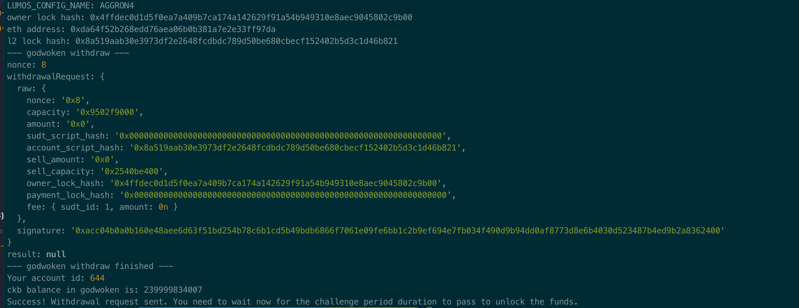

## A screenshot of the console output immediately after running the withdraw command.

## The Ethereum address that you've used for your Layer 2 account (in text format).
0xDa64f52b268EdD76AEA06b0B381a7E2e33fF97da
## The Nervos Layer 1 address that you passed to withdraw command (in text format).
ckt1qyq0vhdettz6vddh7a6vxys3xp35684tmj5slrhvdw